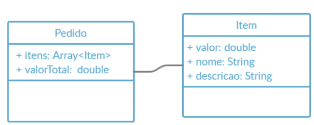
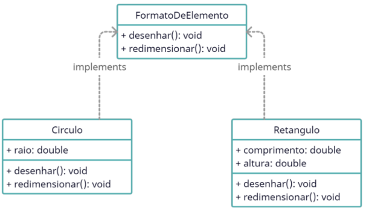

# Atividade Diagrama de Classes

#### 1. Implemente e teste o modelo de classes com base na seguinte imagem:

#### 2. Implemente e teste o modelo de classes com base no seguinte imagem:

#### 3.Crie o diagrama de classe da atividade 3 da lista de atividades sobre Pilares POO e Composição.

- Identifique os atributos e comportamentos que são comuns entre os 3 animais e encapsule-os na superclasse Animal. Crie pelo menos 1 comportamento diferente para cada animal. 
#### 4. Chegou a hora de mostrar o quanto você sabe colocar no papel (ou code) o que pensa. Você deve pensar, modelar, programar e testar um modelo de classes baseado em uma situação da vida real. Ex: Locação de livros, restaurante...
#### 5. Corrija os erros do codigo abaixo:    
    interface Desconto {
      aplicarDescontoEmPorcentagem(desconto: number): void{
        throw 'Pegadinha do malandro!';
      }

      recuperarValorTotal(): number;
    }

    interface ValorPedido {
      aplicarDescontoEmReais(desconto: number): void;
      removeItem(item: string): void {
        const index = this.itens.findIndex((i) => i.nome === item);
        if (index > -1) {
          this.itens.splice(index, 1);
        }
      }
    }

    class Pedido implements ValorPedido {
      itens: ItemPedido[] = [];

      add(item: ItemPedido): void {
        this.itens.push(item);
      }
      
      recuperarValorTotal(): number {
        let total = this.itens
          .map((i) => i.recuperarValorTotal())
          .reduce((sum, v) => sum + v, 0);

        return total;
      }

      aplicarDescontoEmPorcentagem(desconto: number): void {
        const porcentagem = desconto / 100;
        const descontoEmReais = this.valor * porcentagem;
        this.valor -= descontoEmReais;
      }
    }

    class ItemPedido extends ValorPedido, Desconto {
      valor: number;
      nome: string;
      quantidade: number;

      constructor(valor: number, nome: string, quantidade: number) {
        this.valor = valor;
        this.nome = nome;
        this.quantidade = quantidade;
      }

      recuperarValorTotal(): number {
        return this.valor * this.quantidade;
      }

      aplicarDescontoEmReais(desconto: number): void {
        this.valor -= desconto;
      }
    }
